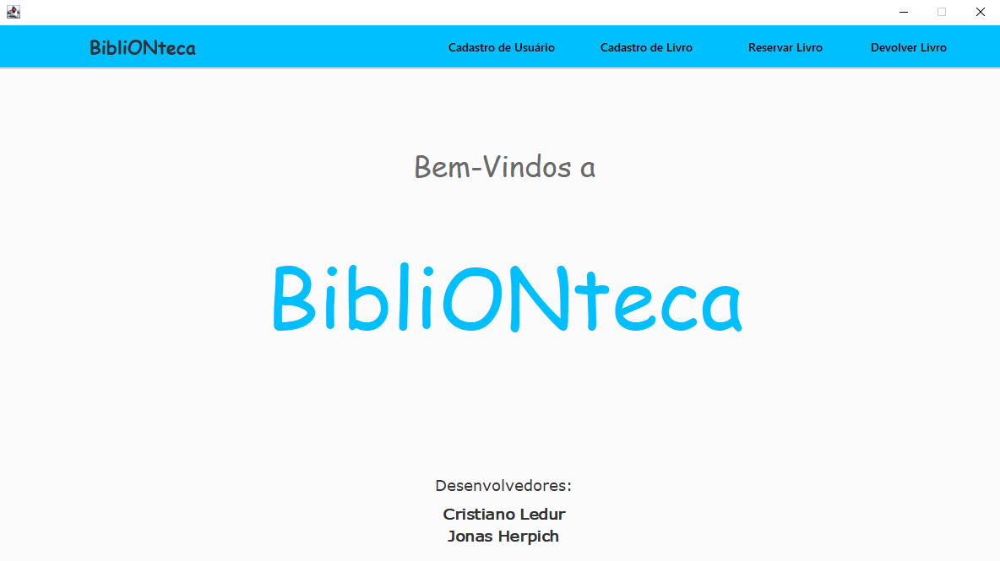

# BibliONteca

> Projeto desenvolvido no curso de "Programação II - programação orientada a objetos com java" do IFRS campus Feliz, proposto pelo professor Moser Fagundes.

## 🚀 Acessando BibliONteca

Para acessar a BibliONteca, se faz necessário:

* Utilizar o `eclipse através do WindowBuilder`
* Utilizar a versão `18 java JDK`.

## ☕ Sobre o BibliONteca

O objetivo desta aplicação é construir um sistema de gerenciamento de acervo de biblioteca. Ela permitirá o cadastro de usuários e livros, e o registro de empréstimos e devoluções.
A proposta do sistema é ser orientado a objetos e usar a classe ArrayList para armazenar os objetos. O sistema contém uma interface gráfica com menu para acessar as funcionalidades. Os dados manipulados dentro da aplicação devem ser armazenados em um arquivo txt e ao iniciar o sistema devem ser carregados e atualizados de acordo com as operações realizadas.

## 📝 Licença

Esse projeto está sob licença. Veja o arquivo [LICENÇA](LICENSE.md) para mais detalhes.

[⬆ Voltar ao topo](#BibliONteca) 
